# ARCHITECTURE DOCUMENTATION

Dokumentasi arsitektur teknis dari Sistem Repository LPEM FEB UI.

---

## Table of Contents

1. [Application Architecture](#application-architecture)
2. [Technology Stack Layers](#technology-stack-layers)
3. [Request-Response Flow](#request-response-flow)
4. [Component Architecture](#component-architecture)
5. [Data Flow](#data-flow)
6. [Authentication Architecture](#authentication-architecture)
7. [File Storage Architecture](#file-storage-architecture)
8. [Deployment Architecture](#deployment-architecture)

---

## 1. Application Architecture

### High-Level Architecture

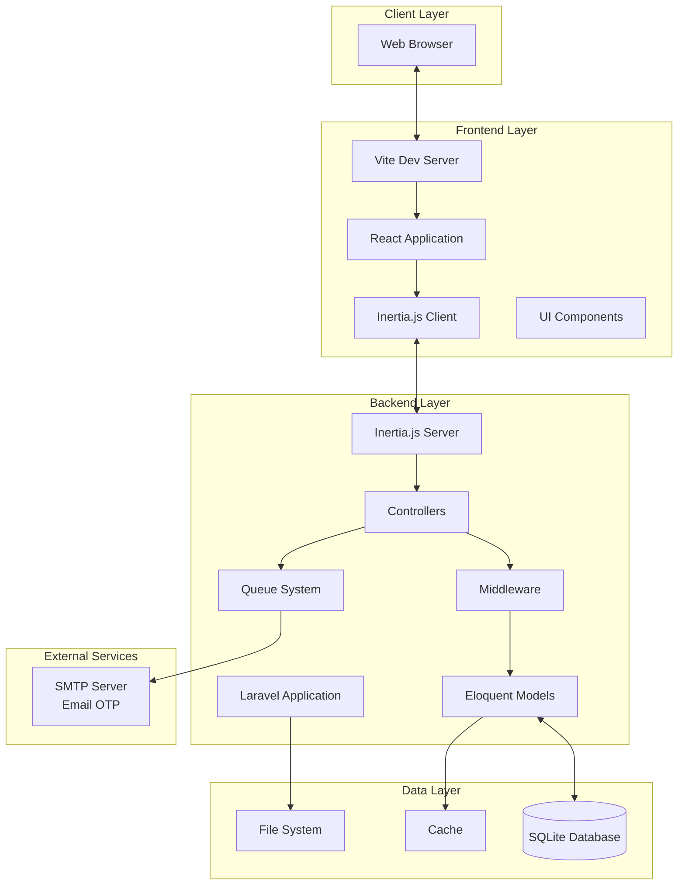

### Architecture Pattern

Sistem ini menggunakan beberapa design patterns:

1. **MVC (Model-View-Controller)**
    - **Model**: Eloquent ORM (User, Asset, Client, dll)
    - **View**: React Components via Inertia.js
    - **Controller**: Laravel Controllers

2. **Repository Pattern** (Implicit via Eloquent)
    - Eloquent Models act as repositories
    - Abstraksi database queries

3. **Service Layer Pattern** (untuk business logic kompleks)
    - AssetService, AuthService, dll

4. **Middleware Pattern**
    - Authentication (auth)
    - Role checking (role middleware)
    - Permission checking

---

## 2. Technology Stack Layers

### Layer Diagram

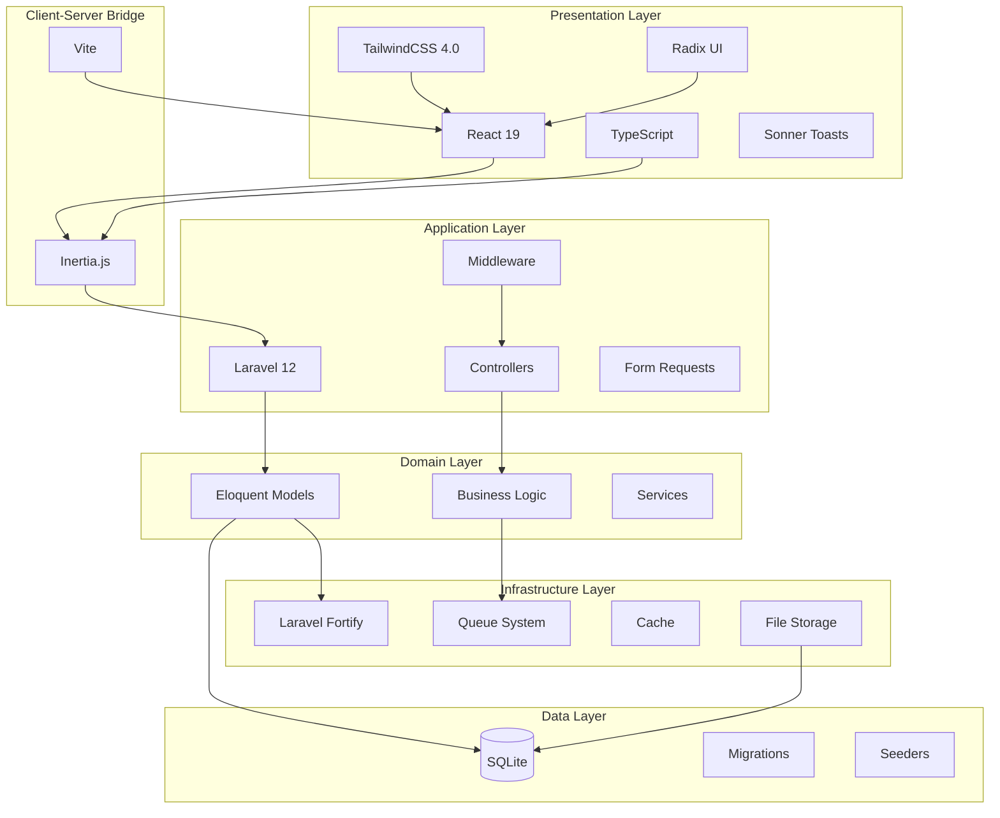

### Stack Components

| Layer                  | Technology      | Purpose                        |
| ---------------------- | --------------- | ------------------------------ |
| **Frontend Framework** | React 19        | UI rendering & interactivity   |
| **Type Safety**        | TypeScript 5.7  | Static typing                  |
| **Styling**            | TailwindCSS 4.0 | Utility-first CSS              |
| **UI Components**      | Radix UI        | Headless accessible components |
| **Charts**             | Recharts 3.6    | Data visualization             |
| **Notifications**      | Sonner          | Toast notifications            |
| **Build Tool**         | Vite 7          | Fast development & build       |
| **SPA Adapter**        | Inertia.js 2.1  | Server-side routing for React  |
| **Backend Framework**  | Laravel 12      | PHP framework                  |
| **Authentication**     | Laravel Fortify | Auth scaffolding               |
| **ORM**                | Eloquent        | Database abstraction           |
| **Database**           | SQLite          | Embedded database              |
| **Task Queue**         | Laravel Queue   | Async job processing           |
| **Email**              | SMTP            | Email delivery                 |

---

## 3. Request-Response Flow

### Traditional Page Request (Inertia)

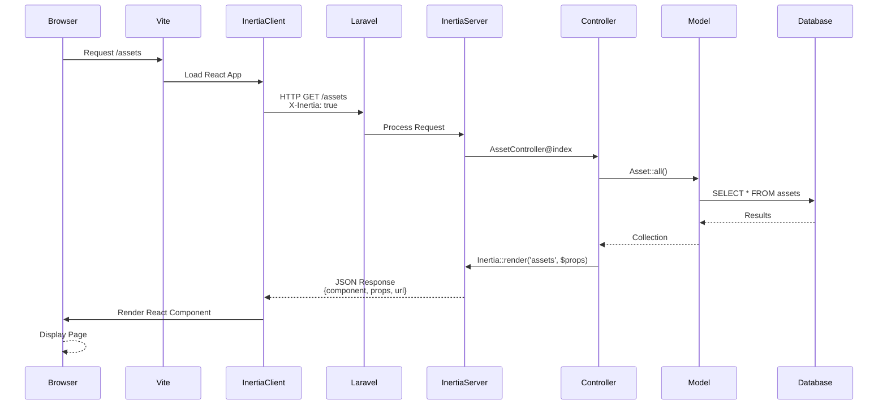

### Form Submission (Inertia)

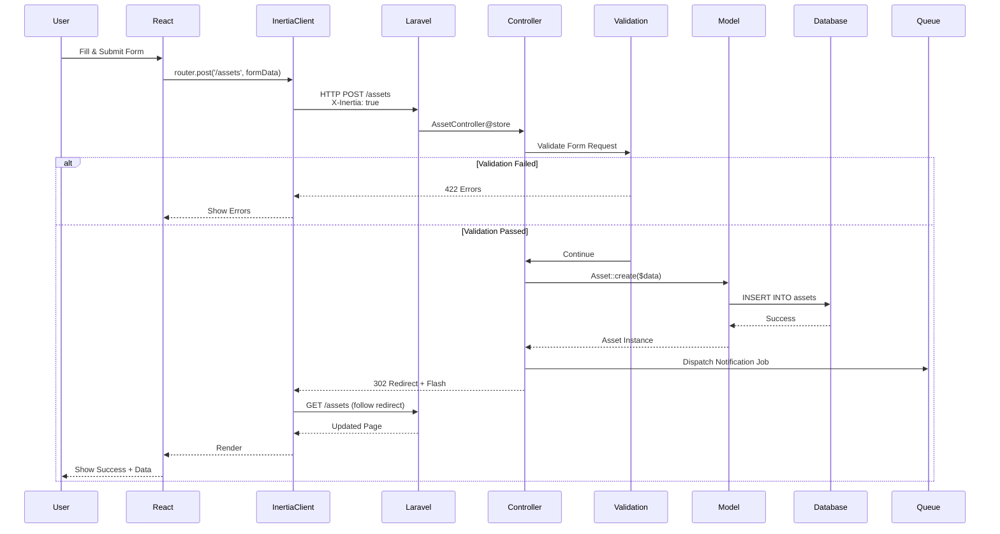

### API Request Flow (if applicable)

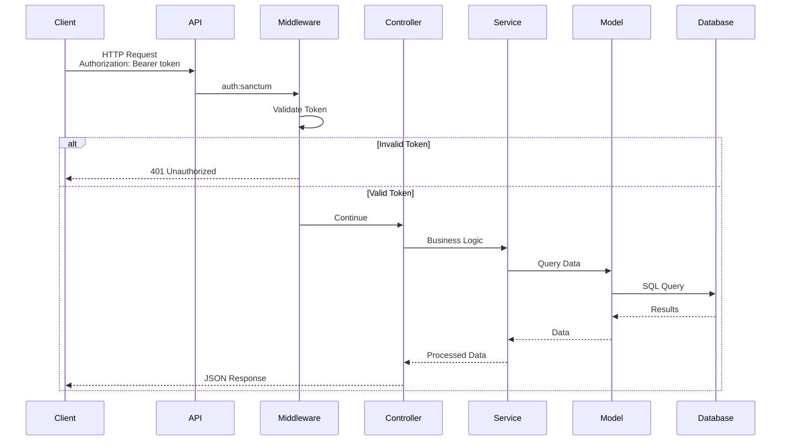

---

## 4. Component Architecture

### Frontend Component Hierarchy

```
App Root (Inertia)
│
├── Layouts
│   ├── AppLayout
│   │   ├── Navbar
│   │   ├── Sidebar (if exists)
│   │   └── Footer
│   └── GuestLayout
│
├── Pages (Inertia Pages)
│   ├── Welcome
│   ├── Dashboard
│   ├── Assets
│   │   └── uses: AssetTable, AssetDialog
│   ├── Clients
│   │   └── uses: ClientTable, ClientDialog
│   ├── Users
│   │   └── uses: UserTable, UserDialog
│   ├── Roles
│   └── Permissions
│
└── Components (Reusable)
    ├── UI (shadcn/ui)
    │   ├── Button
    │   ├── Dialog
    │   ├── Input
    │   ├── Select
    │   ├── Table
    │   └── Toast (Sonner)
    │
    ├── Domain Specific
    │   ├── AssetTable
    │   ├── AssetDialog
    │   ├── ClientTable
    │   ├── ClientDialog
    │   ├── SearchBar
    │   └── FilterSidebar
    │
    └── Charts
        ├── BarChart
        ├── PieChart
        └── LineChart
```

### Backend Component Hierarchy

```
Laravel Application
│
├── Routes
│   ├── web.php (main routes)
│   └── settings.php
│
├── Middleware
│   ├── Authenticate
│   ├── RoleMiddleware
│   └── HandleInertiaRequests
│
├── Controllers
│   ├── AssetController
│   ├── ClientController
│   ├── UserController
│   ├── RoleController
│   ├── PermissionController
│   └── Auth/OtpLoginController
│
├── Models (Eloquent)
│   ├── User
│   ├── Asset
│   ├── Client
│   ├── Role
│   ├── Permission
│   └── Wilayah
│
├── Requests (Form Validation)
│   ├── StoreAssetRequest
│   ├── UpdateAssetRequest
│   └── ...
│
└── Jobs (Queue)
    └── SendOtpEmail
```

---

## 5. Data Flow

### Asset Creation Data Flow

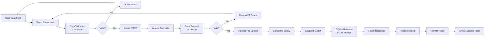

### Authentication Data Flow (OTP)

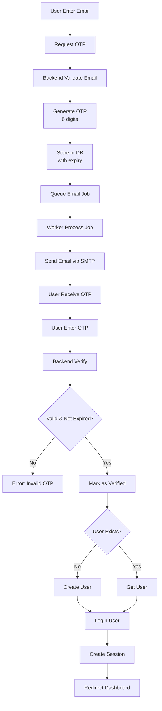

### Permission Check Data Flow

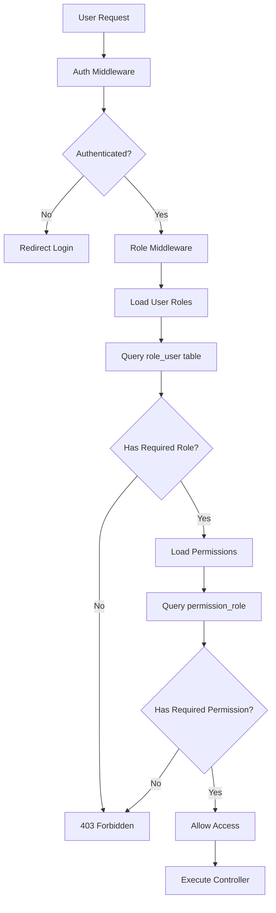

---

## 6. Authentication Architecture

### OTP Authentication System

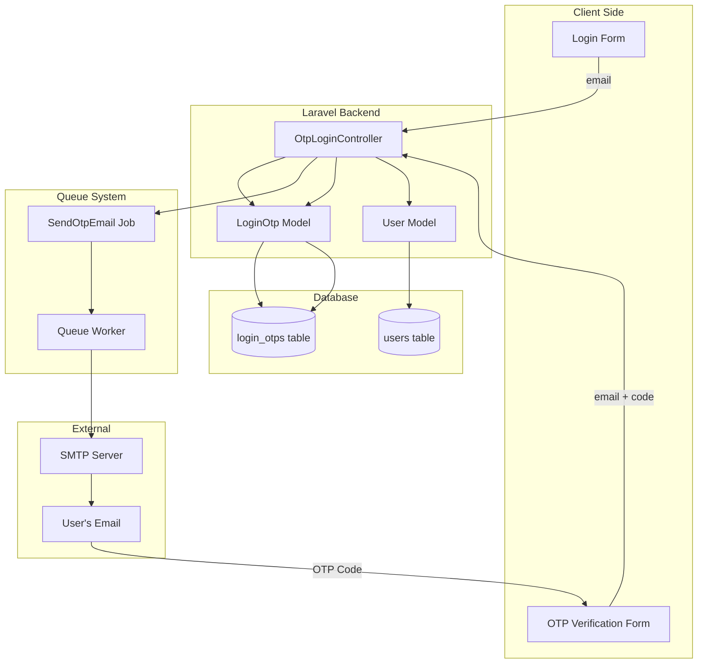

### Session Management

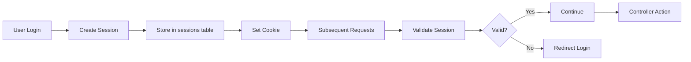

---

## 7. File Storage Architecture

### Binary Storage in Database

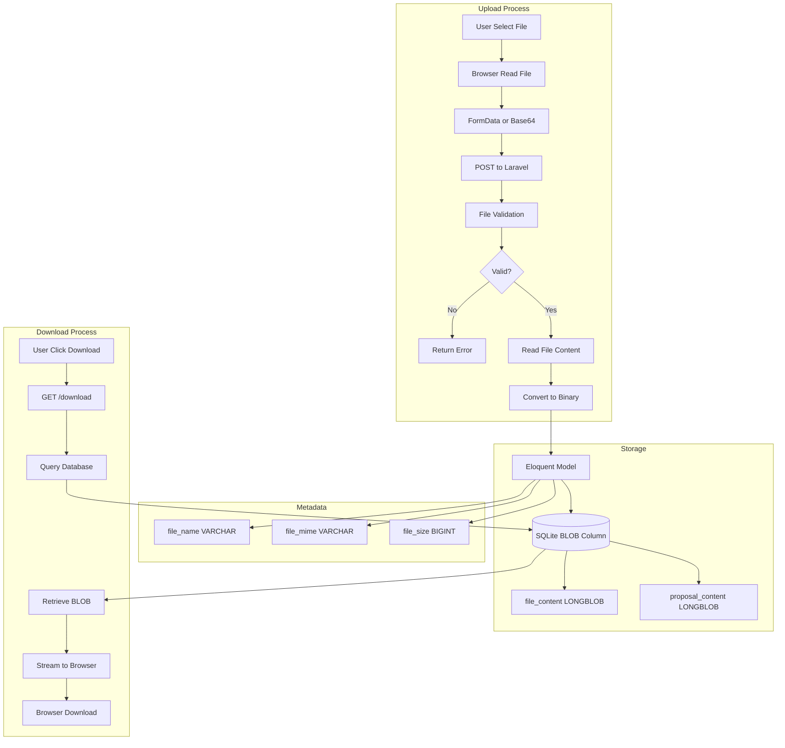

### Storage Schema

```
assets table:
├── file_content      (LONGBLOB)    - Binary file content
├── file_name         (VARCHAR)     - Original filename
├── file_mime         (VARCHAR)     - MIME type (application/pdf)
├── file_size         (BIGINT)      - File size in bytes
├── proposal_content  (LONGBLOB)    - Binary proposal content
├── proposal_name     (VARCHAR)     - Proposal filename
├── proposal_mime     (VARCHAR)     - Proposal MIME type
└── proposal_size     (BIGINT)      - Proposal size in bytes
```

**Advantages:**

- ✅ Single backup (database backup includes files)
- ✅ ACID compliance
- ✅ Atomic operations
- ✅ No filesystem permission issues
- ✅ Easy deployment

**Considerations:**

- ⚠️ Database size grows with files
- ⚠️ Regular VACUUM needed for SQLite
- ⚠️ Max file size: 200MB

---

## 8. Deployment Architecture

### Development Environment

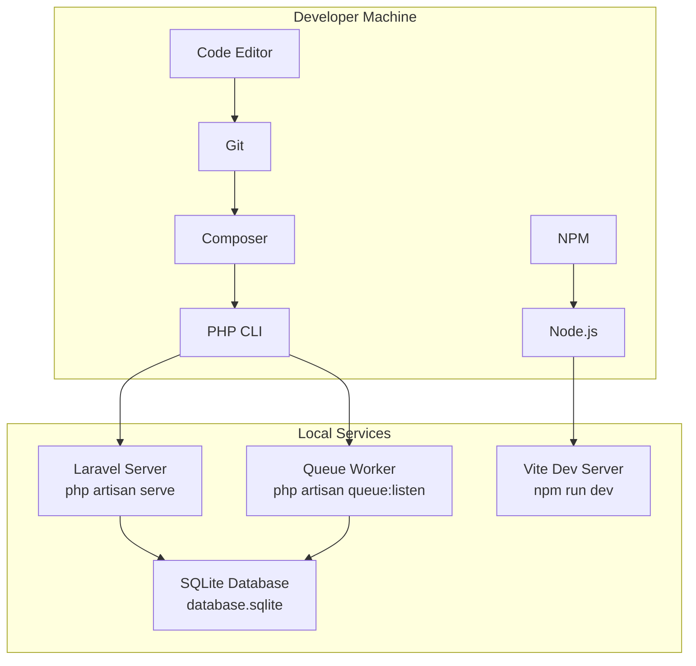

### Production Environment (Example)

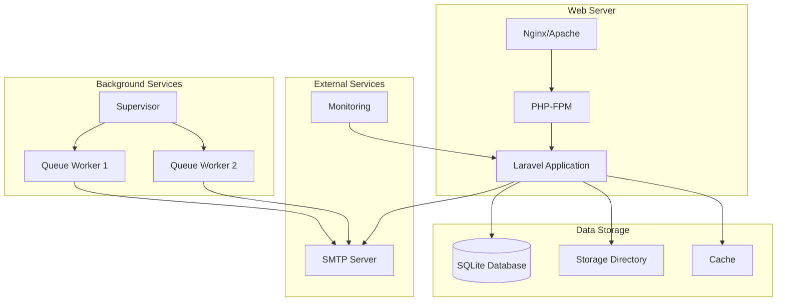

### Deployment Checklist

**Environment Configuration:**

```bash
# Production .env
APP_ENV=production
APP_DEBUG=false
APP_URL=https://repository.lpem.org

# Cache optimization
php artisan config:cache
php artisan route:cache
php artisan view:cache

# Build assets
npm run build
```

**Web Server Configuration (Nginx Example):**

```nginx
server {
    listen 80;
    server_name repository.lpem.org;
    root /var/www/inventory-app/public;

    index index.php;

    location / {
        try_files $uri $uri/ /index.php?$query_string;
    }

    location ~ \.php$ {
        fastcgi_pass unix:/var/run/php/php8.2-fpm.sock;
        fastcgi_index index.php;
        include fastcgi_params;
    }

    client_max_body_size 210M;
}
```

**Supervisor Configuration (Queue Worker):**

```ini
[program:inventory-queue]
process_name=%(program_name)s_%(process_num)02d
command=php /var/www/inventory-app/artisan queue:work --tries=3
autostart=true
autorestart=true
user=www-data
numprocs=2
redirect_stderr=true
stdout_logfile=/var/www/inventory-app/storage/logs/queue.log
```

---

## Security Architecture

### Security Layers

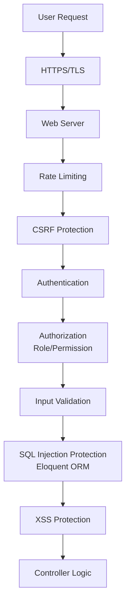

### Security Features

| Layer                | Implementation        | Protection                 |
| -------------------- | --------------------- | -------------------------- |
| **Transport**        | HTTPS/TLS             | Data encryption in transit |
| **Authentication**   | Laravel Fortify + OTP | Secure login               |
| **Session**          | Encrypted cookies     | Session hijacking          |
| **CSRF**             | Token validation      | Cross-site request forgery |
| **XSS**              | React escaping        | Cross-site scripting       |
| **SQL Injection**    | Eloquent ORM          | Parameterized queries      |
| **Authorization**    | Role/Permission       | Unauthorized access        |
| **Rate Limiting**    | Throttle middleware   | Brute force attacks        |
| **Input Validation** | Form Requests         | Malicious input            |

---

## Monitoring & Logging

### Log Structure

```
storage/logs/
├── laravel.log          # Main application log
├── queue.log            # Queue worker log
└── custom/
    ├── auth.log         # Authentication events
    ├── asset.log        # Asset operations
    └── error.log        # Error tracking
```

### Monitoring Points

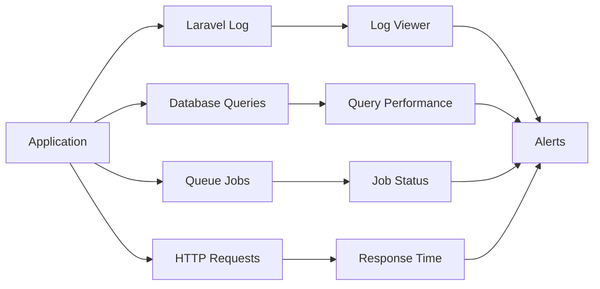

---

## Performance Optimization

### Caching Strategy

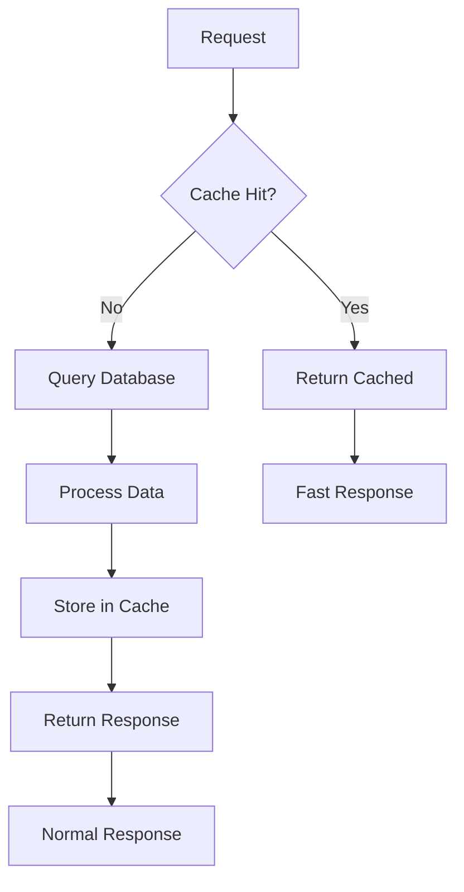

### Optimization Techniques

1. **Database Optimization**
    - Proper indexing
    - Query optimization
    - VACUUM for SQLite

2. **Application Optimization**
    - Config caching
    - Route caching
    - View caching
    - Eager loading (avoid N+1)

3. **Asset Optimization**
    - Vite code splitting
    - Image optimization
    - CSS/JS minification

4. **Server Optimization**
    - OPcache enabled
    - PHP-FPM tuning
    - Gzip compression

---

**Last Updated:** 14 Februari 2026  
**Version:** 1.0.0
