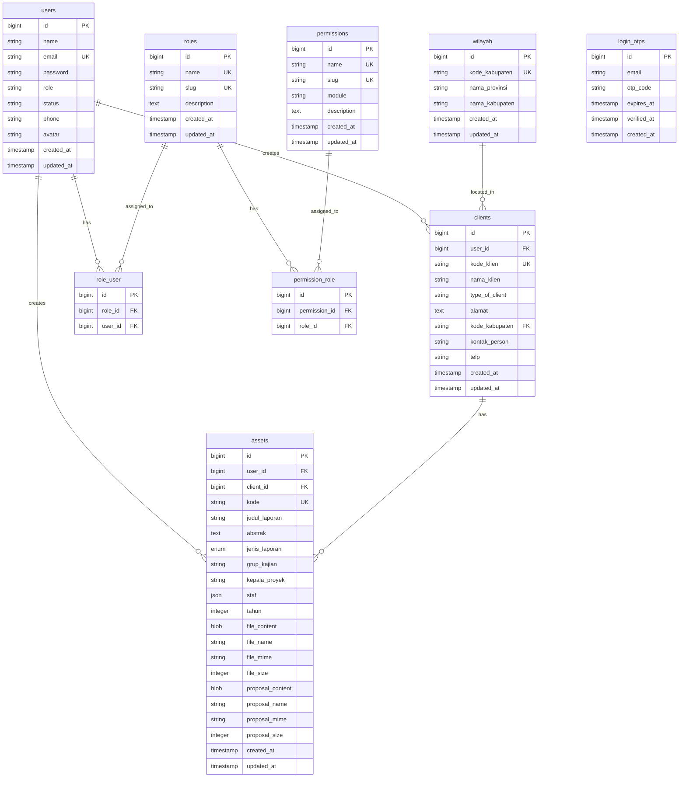

# DATABASE SCHEMA DOCUMENTATION

## Entity Relationship Diagram (ERD)

### Complete Database Structure



---

## Table Relationships

### Primary Relationships

#### 1. Users → Assets (One-to-Many)

```sql
-- One user can create many assets
users.id → assets.user_id

-- Example query
SELECT u.name, a.judul_laporan
FROM users u
LEFT JOIN assets a ON u.id = a.user_id;
```

#### 2. Users → Clients (One-to-Many)

```sql
-- One user can create many clients
users.id → clients.user_id

-- Example query
SELECT u.name, c.nama_klien
FROM users u
LEFT JOIN clients c ON u.id = c.user_id;
```

#### 3. Clients → Assets (One-to-Many)

```sql
-- One client can have many assets/projects
clients.id → assets.client_id

-- Example query
SELECT c.nama_klien, COUNT(a.id) as total_projects
FROM clients c
LEFT JOIN assets a ON c.id = a.client_id
GROUP BY c.id;
```

#### 4. Wilayah → Clients (One-to-Many)

```sql
-- One wilayah can have many clients
wilayah.kode_kabupaten → clients.kode_kabupaten

-- Example query
SELECT w.nama_kabupaten, c.nama_klien
FROM wilayah w
LEFT JOIN clients c ON w.kode_kabupaten = c.kode_kabupaten;
```

### Many-to-Many Relationships

#### 5. Users ↔ Roles (Many-to-Many via role_user)

```sql
-- One user can have many roles
-- One role can be assigned to many users

-- Example query: Get all roles for a user
SELECT r.*
FROM roles r
INNER JOIN role_user ru ON r.id = ru.role_id
WHERE ru.user_id = 1;

-- Example query: Get all users with a specific role
SELECT u.*
FROM users u
INNER JOIN role_user ru ON u.id = ru.user_id
INNER JOIN roles r ON ru.role_id = r.id
WHERE r.slug = 'admin';
```

#### 6. Roles ↔ Permissions (Many-to-Many via permission_role)

```sql
-- One role can have many permissions
-- One permission can belong to many roles

-- Example query: Get all permissions for a role
SELECT p.*
FROM permissions p
INNER JOIN permission_role pr ON p.id = pr.permission_id
WHERE pr.role_id = 1;

-- Example query: Get all roles that have a specific permission
SELECT r.*
FROM roles r
INNER JOIN permission_role pr ON r.id = pr.role_id
INNER JOIN permissions p ON pr.permission_id = p.id
WHERE p.slug = 'assets.create';
```

#### Combined Query: Check if user has permission

```sql
-- Check if user has a specific permission through their roles
SELECT COUNT(*) > 0 as has_permission
FROM users u
INNER JOIN role_user ru ON u.id = ru.user_id
INNER JOIN roles r ON ru.role_id = r.id
INNER JOIN permission_role pr ON r.id = pr.role_id
INNER JOIN permissions p ON pr.permission_id = p.id
WHERE u.id = 1 AND p.slug = 'assets.create';
```

---

## Indexes & Constraints

### Primary Keys

```sql
-- All tables have auto-increment primary key
ALTER TABLE users ADD PRIMARY KEY (id);
ALTER TABLE assets ADD PRIMARY KEY (id);
ALTER TABLE clients ADD PRIMARY KEY (id);
ALTER TABLE wilayah ADD PRIMARY KEY (id);
ALTER TABLE roles ADD PRIMARY KEY (id);
ALTER TABLE permissions ADD PRIMARY KEY (id);
ALTER TABLE role_user ADD PRIMARY KEY (id);
ALTER TABLE permission_role ADD PRIMARY KEY (id);
ALTER TABLE login_otps ADD PRIMARY KEY (id);
```

### Unique Constraints

```sql
-- Enforce uniqueness
ALTER TABLE users ADD UNIQUE (email);
ALTER TABLE assets ADD UNIQUE (kode);
ALTER TABLE clients ADD UNIQUE (kode_klien);
ALTER TABLE wilayah ADD UNIQUE (kode_kabupaten);
ALTER TABLE roles ADD UNIQUE (name);
ALTER TABLE roles ADD UNIQUE (slug);
ALTER TABLE permissions ADD UNIQUE (name);
ALTER TABLE permissions ADD UNIQUE (slug);
```

### Foreign Keys

```sql
-- assets table
ALTER TABLE assets ADD FOREIGN KEY (user_id) REFERENCES users(id) ON DELETE SET NULL;
ALTER TABLE assets ADD FOREIGN KEY (client_id) REFERENCES clients(id) ON DELETE SET NULL;

-- clients table
ALTER TABLE clients ADD FOREIGN KEY (user_id) REFERENCES users(id) ON DELETE SET NULL;
ALTER TABLE clients ADD FOREIGN KEY (kode_kabupaten) REFERENCES wilayah(kode_kabupaten) ON DELETE RESTRICT;

-- role_user pivot table
ALTER TABLE role_user ADD FOREIGN KEY (role_id) REFERENCES roles(id) ON DELETE CASCADE;
ALTER TABLE role_user ADD FOREIGN KEY (user_id) REFERENCES users(id) ON DELETE CASCADE;

-- permission_role pivot table
ALTER TABLE permission_role ADD FOREIGN KEY (permission_id) REFERENCES permissions(id) ON DELETE CASCADE;
ALTER TABLE permission_role ADD FOREIGN KEY (role_id) REFERENCES roles(id) ON DELETE CASCADE;
```

### Indexes for Performance

```sql
-- Frequently queried columns
CREATE INDEX idx_users_email ON users(email);
CREATE INDEX idx_users_role ON users(role);
CREATE INDEX idx_users_status ON users(status);

CREATE INDEX idx_assets_kode ON assets(kode);
CREATE INDEX idx_assets_user_id ON assets(user_id);
CREATE INDEX idx_assets_client_id ON assets(client_id);
CREATE INDEX idx_assets_tahun ON assets(tahun);
CREATE INDEX idx_assets_jenis_laporan ON assets(jenis_laporan);
CREATE INDEX idx_assets_grup_kajian ON assets(grup_kajian);

CREATE INDEX idx_clients_kode_klien ON clients(kode_klien);
CREATE INDEX idx_clients_user_id ON clients(user_id);
CREATE INDEX idx_clients_kode_kabupaten ON clients(kode_kabupaten);

CREATE INDEX idx_permissions_module ON permissions(module);
CREATE INDEX idx_permissions_slug ON permissions(slug);

CREATE INDEX idx_roles_slug ON roles(slug);

CREATE INDEX idx_login_otps_email ON login_otps(email);
CREATE INDEX idx_login_otps_expires_at ON login_otps(expires_at);
```

---

## Data Types & Constraints

### users table

```sql
CREATE TABLE users (
    id BIGINT UNSIGNED AUTO_INCREMENT PRIMARY KEY,
    name VARCHAR(255) NOT NULL,
    email VARCHAR(255) NOT NULL UNIQUE,
    password VARCHAR(255) NOT NULL,
    role VARCHAR(50) DEFAULT 'user',
    status VARCHAR(20) DEFAULT 'active',
    phone VARCHAR(20),
    avatar VARCHAR(255),
    email_verified_at TIMESTAMP NULL,
    remember_token VARCHAR(100),
    created_at TIMESTAMP DEFAULT CURRENT_TIMESTAMP,
    updated_at TIMESTAMP DEFAULT CURRENT_TIMESTAMP ON UPDATE CURRENT_TIMESTAMP
);
```

### assets table

```sql
CREATE TABLE assets (
    id BIGINT UNSIGNED AUTO_INCREMENT PRIMARY KEY,
    user_id BIGINT UNSIGNED,
    client_id BIGINT UNSIGNED,
    kode VARCHAR(50) NOT NULL UNIQUE,
    judul_laporan VARCHAR(500) NOT NULL,
    abstrak TEXT NOT NULL,
    jenis_laporan ENUM('penelitian_survey', 'penelitian', 'diklat', 'jurnal', 'buku', 'lainnya') NOT NULL,
    grup_kajian VARCHAR(100),
    kepala_proyek VARCHAR(255) NOT NULL,
    staf JSON NOT NULL,
    tahun INT NOT NULL,
    file_content LONGBLOB,
    file_name VARCHAR(255),
    file_mime VARCHAR(100),
    file_size BIGINT,
    proposal_content LONGBLOB,
    proposal_name VARCHAR(255),
    proposal_mime VARCHAR(100),
    proposal_size BIGINT,
    created_at TIMESTAMP DEFAULT CURRENT_TIMESTAMP,
    updated_at TIMESTAMP DEFAULT CURRENT_TIMESTAMP ON UPDATE CURRENT_TIMESTAMP,
    FOREIGN KEY (user_id) REFERENCES users(id) ON DELETE SET NULL,
    FOREIGN KEY (client_id) REFERENCES clients(id) ON DELETE SET NULL
);
```

### clients table

```sql
CREATE TABLE clients (
    id BIGINT UNSIGNED AUTO_INCREMENT PRIMARY KEY,
    user_id BIGINT UNSIGNED,
    kode_klien VARCHAR(50) NOT NULL UNIQUE,
    nama_klien VARCHAR(255) NOT NULL,
    type_of_client VARCHAR(100),
    alamat TEXT NOT NULL,
    kode_kabupaten VARCHAR(4) NOT NULL,
    kontak_person VARCHAR(255) NOT NULL,
    telp VARCHAR(20) NOT NULL,
    created_at TIMESTAMP DEFAULT CURRENT_TIMESTAMP,
    updated_at TIMESTAMP DEFAULT CURRENT_TIMESTAMP ON UPDATE CURRENT_TIMESTAMP,
    FOREIGN KEY (user_id) REFERENCES users(id) ON DELETE SET NULL,
    FOREIGN KEY (kode_kabupaten) REFERENCES wilayah(kode_kabupaten) ON DELETE RESTRICT
);
```

### wilayah table

```sql
CREATE TABLE wilayah (
    id BIGINT UNSIGNED AUTO_INCREMENT PRIMARY KEY,
    kode_kabupaten VARCHAR(4) NOT NULL UNIQUE,
    nama_provinsi VARCHAR(100) NOT NULL,
    nama_kabupaten VARCHAR(100) NOT NULL,
    created_at TIMESTAMP DEFAULT CURRENT_TIMESTAMP,
    updated_at TIMESTAMP DEFAULT CURRENT_TIMESTAMP ON UPDATE CURRENT_TIMESTAMP
);
```

### roles table

```sql
CREATE TABLE roles (
    id BIGINT UNSIGNED AUTO_INCREMENT PRIMARY KEY,
    name VARCHAR(100) NOT NULL UNIQUE,
    slug VARCHAR(100) NOT NULL UNIQUE,
    description TEXT,
    created_at TIMESTAMP DEFAULT CURRENT_TIMESTAMP,
    updated_at TIMESTAMP DEFAULT CURRENT_TIMESTAMP ON UPDATE CURRENT_TIMESTAMP
);
```

### permissions table

```sql
CREATE TABLE permissions (
    id BIGINT UNSIGNED AUTO_INCREMENT PRIMARY KEY,
    name VARCHAR(100) NOT NULL UNIQUE,
    slug VARCHAR(100) NOT NULL UNIQUE,
    module VARCHAR(50) NOT NULL,
    description TEXT,
    created_at TIMESTAMP DEFAULT CURRENT_TIMESTAMP,
    updated_at TIMESTAMP DEFAULT CURRENT_TIMESTAMP ON UPDATE CURRENT_TIMESTAMP,
    INDEX idx_module (module)
);
```

### role_user table

```sql
CREATE TABLE role_user (
    id BIGINT UNSIGNED AUTO_INCREMENT PRIMARY KEY,
    role_id BIGINT UNSIGNED NOT NULL,
    user_id BIGINT UNSIGNED NOT NULL,
    FOREIGN KEY (role_id) REFERENCES roles(id) ON DELETE CASCADE,
    FOREIGN KEY (user_id) REFERENCES users(id) ON DELETE CASCADE,
    UNIQUE KEY unique_role_user (role_id, user_id)
);
```

### permission_role table

```sql
CREATE TABLE permission_role (
    id BIGINT UNSIGNED AUTO_INCREMENT PRIMARY KEY,
    permission_id BIGINT UNSIGNED NOT NULL,
    role_id BIGINT UNSIGNED NOT NULL,
    FOREIGN KEY (permission_id) REFERENCES permissions(id) ON DELETE CASCADE,
    FOREIGN KEY (role_id) REFERENCES roles(id) ON DELETE CASCADE,
    UNIQUE KEY unique_permission_role (permission_id, role_id)
);
```

### login_otps table

```sql
CREATE TABLE login_otps (
    id BIGINT UNSIGNED AUTO_INCREMENT PRIMARY KEY,
    email VARCHAR(255) NOT NULL,
    otp_code VARCHAR(6) NOT NULL,
    expires_at TIMESTAMP NOT NULL,
    verified_at TIMESTAMP NULL,
    created_at TIMESTAMP DEFAULT CURRENT_TIMESTAMP,
    INDEX idx_email (email),
    INDEX idx_expires_at (expires_at)
);
```

---

## Sample Data Examples

### Sample Users

```sql
INSERT INTO users (name, email, password, role, status) VALUES
('Admin User', 'admin@lpem.org', '$2y$12$hashed_password', 'admin', 'active'),
('John Doe', 'john@example.com', '$2y$12$hashed_password', 'user', 'active'),
('Jane Smith', 'jane@example.com', '$2y$12$hashed_password', 'user', 'active');
```

### Sample Roles

```sql
INSERT INTO roles (name, slug, description) VALUES
('Administrator', 'admin', 'Full system access with all permissions'),
('Regular User', 'user', 'Standard user with limited access'),
('Editor', 'editor', 'Can edit and manage content');
```

### Sample Permissions

```sql
INSERT INTO permissions (name, slug, module, description) VALUES
('View Users', 'users.view', 'users', 'Can view user list'),
('Create Users', 'users.create', 'users', 'Can create new users'),
('Edit Users', 'users.update', 'users', 'Can edit existing users'),
('Delete Users', 'users.delete', 'users', 'Can delete users'),
('View Assets', 'assets.view', 'assets', 'Can view assets'),
('Create Assets', 'assets.create', 'assets', 'Can create new assets'),
('Edit Assets', 'assets.update', 'assets', 'Can edit assets'),
('Delete Assets', 'assets.delete', 'assets', 'Can delete assets');
```

### Sample Clients

```sql
INSERT INTO clients (kode_klien, nama_klien, type_of_client, alamat, kode_kabupaten, kontak_person, telp, user_id) VALUES
('CL-2026-001', 'Kementerian Keuangan RI', 'Government', 'Jl. Lapangan Banteng Timur No.2-4, Jakarta Pusat', '3171', 'Budi Santoso', '021-3449230', 1),
('CL-2026-002', 'Bank Indonesia', 'Government', 'Jl. M.H. Thamrin No.2, Jakarta Pusat', '3171', 'Sarah Wijaya', '021-2981000', 1);
```

### Sample Assets

```sql
INSERT INTO assets (kode, judul_laporan, abstrak, jenis_laporan, grup_kajian, kepala_proyek, staf, tahun, user_id, client_id) VALUES
('RPT-2026-001',
 'Analisis Ekonomi Makro Indonesia 2025',
 'Laporan komprehensif mengenai kondisi ekonomi makro Indonesia tahun 2025...',
 'penelitian',
 'mfpe',
 'Dr. Ahmad Helmy',
 '["Siti Nurhaliza", "Bambang Wijaya", "Lisa Andriani"]',
 2025,
 1,
 1);
```

---

## Query Examples

### Complex Queries for Repository Search

#### 1. Search assets with filters

```sql
SELECT
    a.*,
    c.nama_klien,
    u.name as author_name
FROM assets a
LEFT JOIN clients c ON a.client_id = c.id
LEFT JOIN users u ON a.user_id = u.id
WHERE
    (a.judul_laporan LIKE '%ekonomi%' OR a.abstrak LIKE '%ekonomi%')
    AND a.tahun >= 2020
    AND a.jenis_laporan = 'penelitian'
ORDER BY a.created_at DESC
LIMIT 20 OFFSET 0;
```

#### 2. Get assets by grup kajian with count

```sql
SELECT
    grup_kajian,
    COUNT(*) as total
FROM assets
GROUP BY grup_kajian
ORDER BY total DESC;
```

#### 3. Get user's assets with client info

```sql
SELECT
    a.kode,
    a.judul_laporan,
    a.tahun,
    a.jenis_laporan,
    c.nama_klien,
    c.type_of_client
FROM assets a
LEFT JOIN clients c ON a.client_id = c.id
WHERE a.user_id = 1
ORDER BY a.created_at DESC;
```

#### 4. Get all permissions for a user

```sql
SELECT DISTINCT p.*
FROM users u
INNER JOIN role_user ru ON u.id = ru.user_id
INNER JOIN roles r ON ru.role_id = r.id
INNER JOIN permission_role pr ON r.id = pr.role_id
INNER JOIN permissions p ON pr.permission_id = p.id
WHERE u.id = 1;
```

#### 5. Dashboard statistics

```sql
-- Total assets by year
SELECT tahun, COUNT(*) as total
FROM assets
GROUP BY tahun
ORDER BY tahun DESC;

-- Total assets by jenis laporan
SELECT jenis_laporan, COUNT(*) as total
FROM assets
GROUP BY jenis_laporan;

-- Top clients by project count
SELECT
    c.nama_klien,
    COUNT(a.id) as total_projects
FROM clients c
LEFT JOIN assets a ON c.id = a.client_id
GROUP BY c.id
ORDER BY total_projects DESC
LIMIT 10;
```

---

## Database Maintenance

### Backup Commands

```bash
# SQLite backup
sqlite3 database/database.sqlite ".backup database/backup/backup_$(date +%Y%m%d).sqlite"

# Export to SQL
sqlite3 database/database.sqlite .dump > database/backup/dump_$(date +%Y%m%d).sql
```

### Optimization

```sql
-- Analyze tables for query optimization
ANALYZE;

-- Vacuum to reclaim space
VACUUM;

-- Reindex all tables
REINDEX;
```

### Check Database Integrity

```sql
PRAGMA integrity_check;
PRAGMA foreign_key_check;
```

---

## Migration Files Reference

All migration files located in: `database/migrations/`

### Core Tables

1. `0001_01_01_000000_create_users_table.php`
2. `2025_11_27_075941_create_assets_table.php`
3. `2025_12_25_000002_create_clients_table.php`
4. `2025_12_25_000001_create_wilayah_table.php`

### Role & Permission System

5. `2025_11_27_062353_create_roles_table.php`
6. `2025_11_27_062356_create_permissions_table.php`
7. `2025_11_27_062358_create_permission_role_table.php`
8. `2025_11_27_062400_create_role_user_table.php`

### Authentication

9. `2025_12_25_000001_create_login_otps_table.php`

### Modifications

10. `2025_11_27_100418_add_two_factor_columns_to_users_table.php`
11. `2025_11_27_044540_add_user_management_fields_to_users_table.php`
12. `2025_12_23_164510_add_user_id_to_assets_table.php`
13. `2025_12_25_110225_add_client_id_to_assets_table.php`
14. `2026_01_13_150848_add_file_binary_columns_to_assets_table.php`
15. `2026_02_04_103725_add_proposal_binary_columns_to_assets_table.php`
16. `2026_02_05_074246_add_type_to_clients_table.php`

---

**Last Updated:** 14 Februari 2026
