# SYSTEM FLOW DIAGRAMS

Dokumentasi ini berisi berbagai diagram alur (flowchart) untuk proses-proses utama dalam Sistem Repository LPEM FEB UI.

---

## Table of Contents

1. [Authentication Flow](#authentication-flow)
2. [Asset Management Flow](#asset-management-flow)
3. [Client Management Flow](#client-management-flow)
4. [User Management Flow](#user-management-flow)
5. [Repository Search Flow](#repository-search-flow)
6. [Permission Checking Flow](#permission-checking-flow)
7. [File Upload Flow](#file-upload-flow)

---

## 1. Authentication Flow

### OTP Login Process

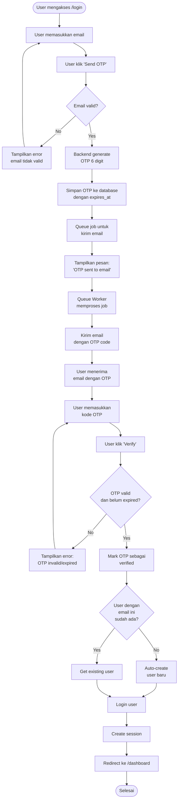

### Traditional Login Process (Jika Ada)

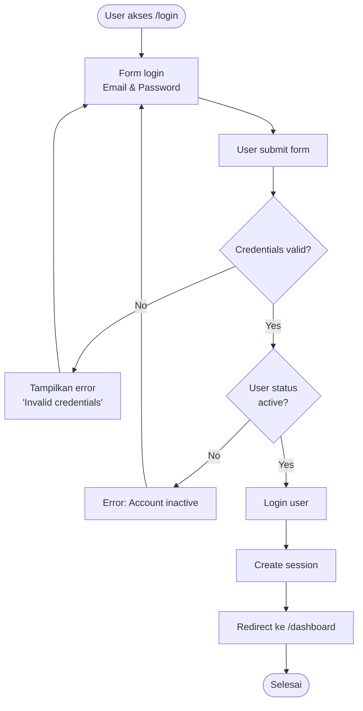

---

## 2. Asset Management Flow

### Create Asset Flow

```mermaid
flowchart TD
    Start([User buka halaman Assets]) --> ClickAdd[Klik 'Add New Asset']
    ClickAdd --> Dialog[Tampilkan dialog form]

    Dialog --> FillForm[User mengisi form:<br>- Kode<br>- Judul<br>- Abstrak<br>- Jenis Laporan<br>- Grup Kajian<br>- Kepala Proyek<br>- Staf<br>- Tahun<br>- Client]

    FillForm --> UploadFile[User upload file laporan]
    UploadFile --> UploadProposal{Upload proposal?}

    UploadProposal -->|Yes| SelectProposal[Upload file proposal]
    UploadProposal -->|No| ClickSubmit[Klik 'Save']
    SelectProposal --> ClickSubmit

    ClickSubmit --> ValidateForm{Form valid?}

    ValidateForm -->|No| ShowErrors[Tampilkan validation errors]
    ShowErrors --> FillForm

    ValidateForm -->|Yes| CheckFileSize{File size <= 200MB?}

    CheckFileSize -->|No| ErrorFileSize[Error: File too large]
    ErrorFileSize --> FillForm

    CheckFileSize -->|Yes| ProcessFile[Backend memproses file:<br>- Read file content<br>- Convert to binary<br>- Get MIME type<br>- Get file size]

    ProcessFile --> SaveAsset[Simpan asset ke database:<br>- Metadata<br>- File content (BLOB)<br>- Proposal content (BLOB)]

    SaveAsset --> Success{Berhasil?}

    Success -->|No| ErrorSave[Error: Gagal menyimpan]
    ErrorSave --> FillForm

    Success -->|Yes| CloseDialog[Tutup dialog]
    CloseDialog --> Refresh[Refresh daftar assets]
    Refresh --> Toast[Tampilkan toast:<br>'Asset created successfully']
    Toast --> End([Selesai])
```

### Update Asset Flow

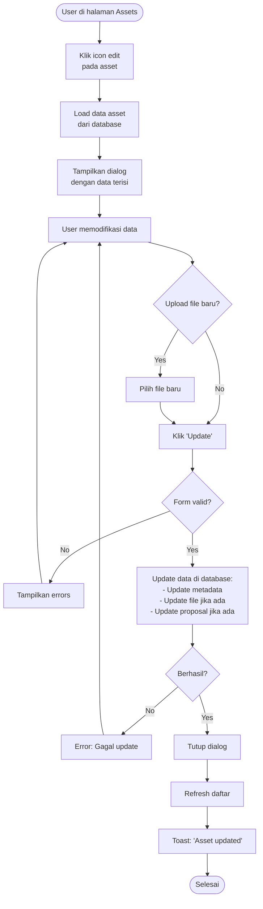

### Delete Asset Flow

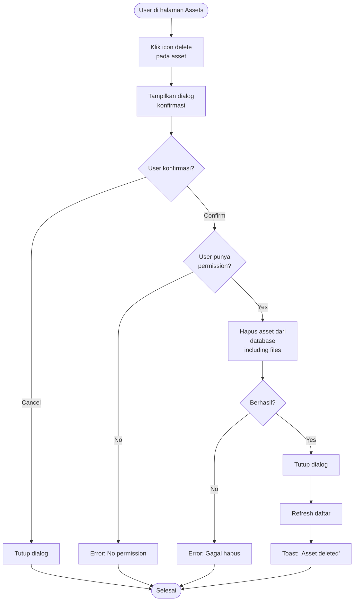

### Download File Flow

```mermaid
flowchart TD
    Start([User klik download button]) --> DetermineType{Type file?}

    DetermineType -->|Laporan| RequestLaporan[GET /assets/{id}/download]
    DetermineType -->|Proposal| RequestProposal[GET /assets/{id}/download-proposal]

    RequestLaporan --> BackendLaporan[Backend ambil file_content<br>dari database]
    RequestProposal --> BackendProposal[Backend ambil proposal_content<br>dari database]

    BackendLaporan --> CheckExists{File exists?}
    BackendProposal --> CheckExists

    CheckExists -->|No| Error404[Error 404:<br>File not found]
    Error404 --> End([Selesai])

    CheckExists -->|Yes| PrepareResponse[Prepare response:<br>- Set headers<br>- Set MIME type<br>- Set filename]

    PrepareResponse --> StreamFile[Stream binary content<br>ke browser]
    StreamFile --> BrowserDownload[Browser memulai download]
    BrowserDownload --> End
```

---

## 3. Client Management Flow

### Create Client Flow

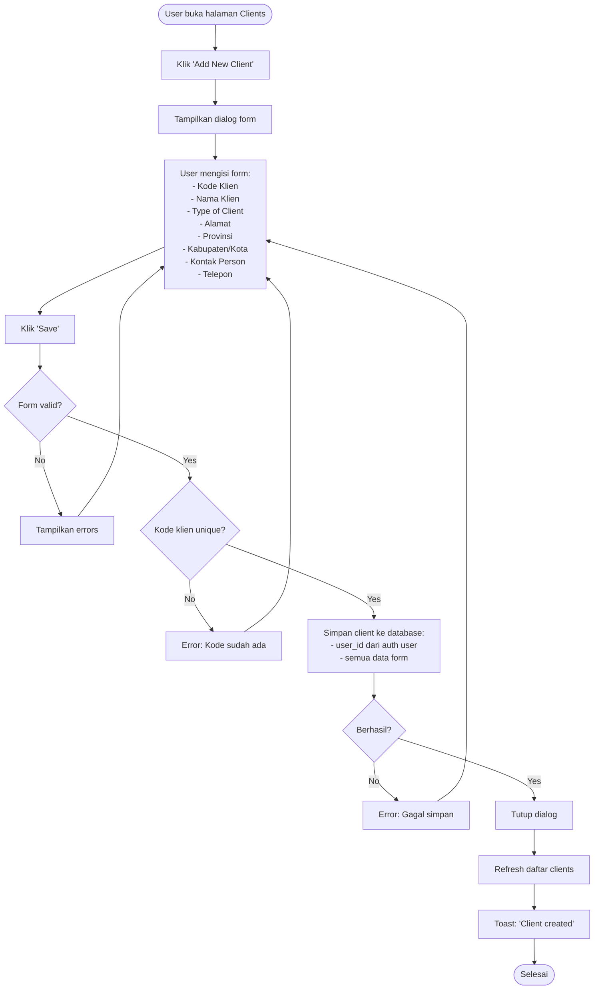

### Update & Delete Client Flow

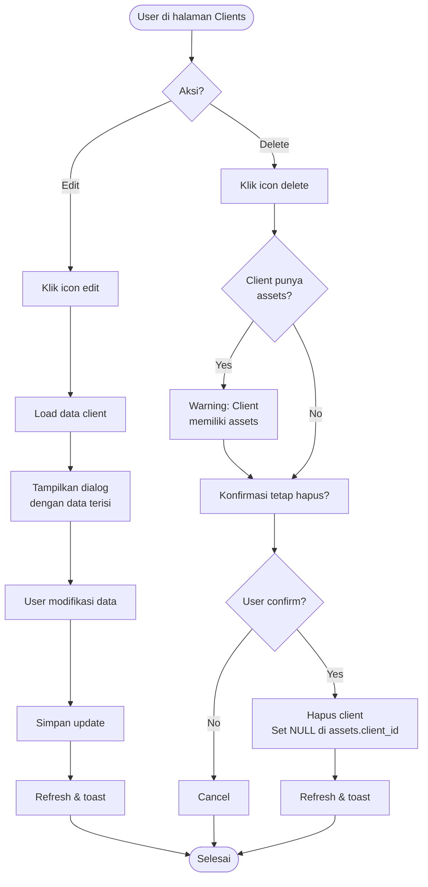

---

## 4. User Management Flow

### Create User Flow (Admin Only)

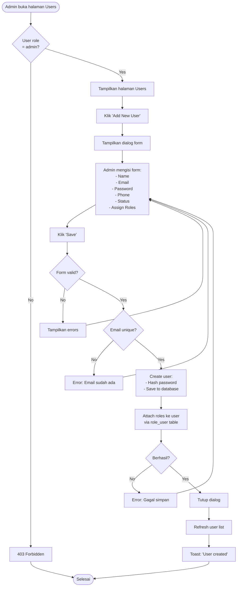

### Assign Roles to User Flow

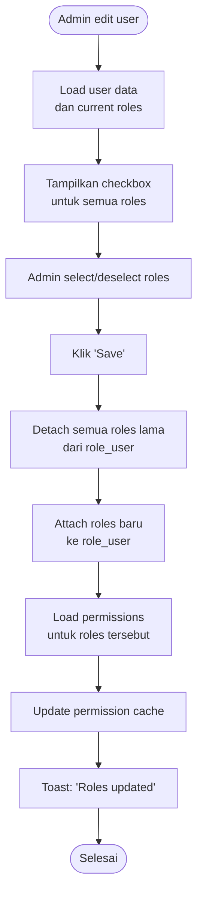

---

## 5. Repository Search Flow

### Public Search Flow

```mermaid
flowchart TD
    Start([User akses /repository]) --> ShowPage[Tampilkan halaman repository<br>dengan search & filters]

    ShowPage --> Input[User input query<br>dan/atau pilih filters:<br>- Search text<br>- Jenis Laporan<br>- Grup Kajian<br>- Tahun<br>- Author]

    Input --> ClickSearch[Klik 'Search' atau auto-search]

    ClickSearch --> BuildQuery[Backend build SQL query:<br>WHERE conditions dengan AND/OR]

    BuildQuery --> AddFilters{Ada filters?}

    AddFilters -->|Jenis Laporan| FilterJenis[AND jenis_laporan = ?]
    AddFilters -->|Grup Kajian| FilterGrup[AND grup_kajian = ?]
    AddFilters -->|Tahun| FilterTahun[AND tahun = ?]
    AddFilters -->|Author| FilterAuthor[AND kepala_proyek LIKE ?]
    AddFilters -->|Search Text| FilterText[AND judul_laporan LIKE ?<br>OR abstrak LIKE ?]

    FilterJenis --> ExecuteQuery
    FilterGrup --> ExecuteQuery
    FilterTahun --> ExecuteQuery
    FilterAuthor --> ExecuteQuery
    FilterText --> ExecuteQuery
    AddFilters -->|No filters| ExecuteQuery[Execute query<br>dengan pagination]

    ExecuteQuery --> JoinTables[JOIN dengan tables:<br>- clients<br>- users<br>- wilayah]

    JoinTables --> GetResults[Get results<br>dengan LIMIT & OFFSET]

    GetResults --> Count[Count total results<br>untuk pagination]

    Count --> FormatData[Format data:<br>- Hide file_content<br>- Add computed fields<br>- Select necessary columns]

    FormatData --> ReturnJSON[Return JSON response<br>ke frontend]

    ReturnJSON --> RenderResults[Render results<br>di halaman]

    RenderResults --> UserAction{User action?}

    UserAction -->|View Detail| ViewDetail[Navigate to<br>/repository/{id}]
    UserAction -->|Download| DownloadFile[Trigger download]
    UserAction -->|Refine Search| Input
    UserAction -->|Pagination| NextPage[Load next page]

    ViewDetail --> End([Selesai])
    DownloadFile --> End
    NextPage --> ClickSearch
```

### Advanced Search Flow

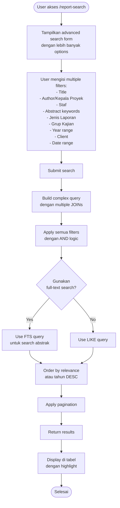

---

## 6. Permission Checking Flow

### Route Permission Check

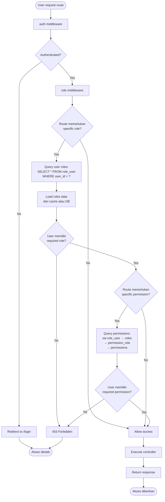

### Permission Check in Frontend

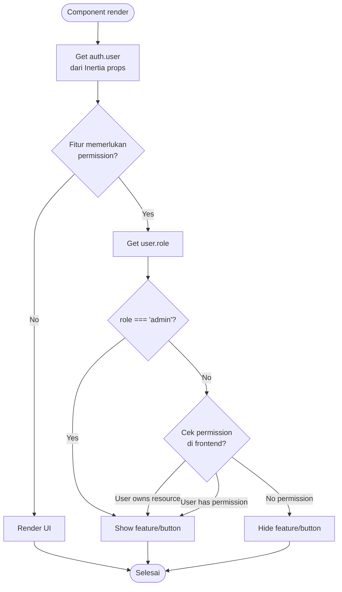

---

## 7. File Upload Flow

### Binary File Upload to Database

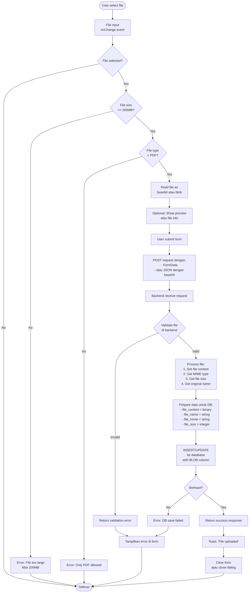

### File Download from Database

```mermaid
flowchart TD
    Start([User klik download]) --> SendRequest[GET /assets/{id}/download]

    SendRequest --> Backend[Backend controller<br>receive request]

    Backend --> CheckAuth{User authenticated<br>jika private?}

    CheckAuth -->|No| Return401[401 Unauthorized]
    Return401 --> End([Gagal])

    CheckAuth -->|Yes| QueryDB[Query database:<br>SELECT file_content,<br>file_name, file_mime<br>FROM assets<br>WHERE id = ?]

    QueryDB --> FileExists{File content<br>exists?}

    FileExists -->|No| Return404[404 Not Found]
    Return404 --> End

    FileExists -->|Yes| PrepareResponse[Prepare HTTP response:<br>- Content-Type: file_mime<br>- Content-Disposition: attachment<br>- filename: file_name]

    PrepareResponse --> StreamContent[Stream binary content<br>dari BLOB column]

    StreamContent --> SendResponse[Send response<br>ke browser]

    SendResponse --> BrowserReceive[Browser receive<br>binary data]

    BrowserReceive --> BrowserDownload[Browser trigger<br>download dialog]

    BrowserDownload --> SaveFile[User save file<br>ke local]

    SaveFile --> EndSuccess([Berhasil])
```

---

## 8. Dashboard Analytics Flow

### Load Dashboard Data

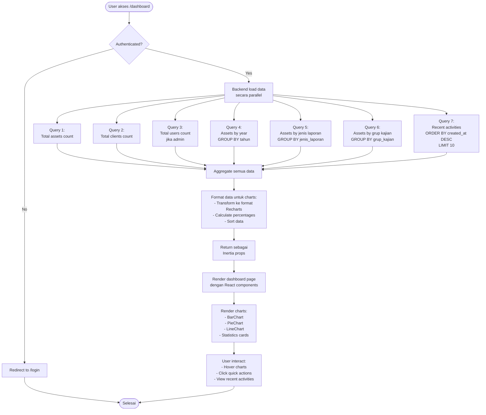

---

## Summary

Dokumen ini mencakup flow diagram untuk:

1. ✅ **Authentication Flow** - OTP login dan traditional login
2. ✅ **Asset Management Flow** - Create, update, delete, dan download assets
3. ✅ **Client Management Flow** - CRUD operations untuk clients
4. ✅ **User Management Flow** - Admin creates users dan assign roles
5. ✅ **Repository Search Flow** - Public search dan advanced search
6. ✅ **Permission Checking Flow** - Route middleware dan frontend checks
7. ✅ **File Upload Flow** - Binary upload ke database dan download
8. ✅ **Dashboard Analytics Flow** - Load dan display statistics

Semua flow menggunakan **Mermaid diagram syntax** yang dapat di-render di Markdown viewers yang mendukung Mermaid (seperti GitHub, GitLab, atau VS Code dengan extension).

---

**Last Updated:** 14 Februari 2026  
**Version:** 1.0.0
